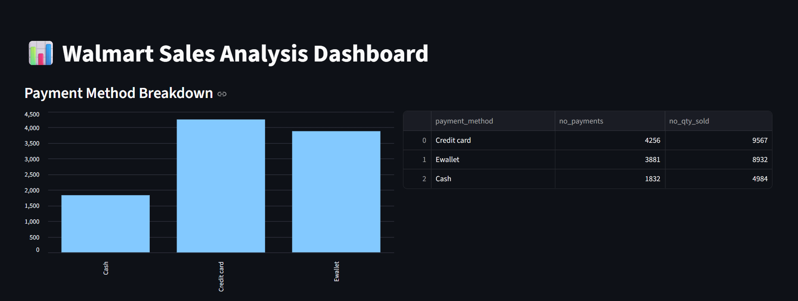
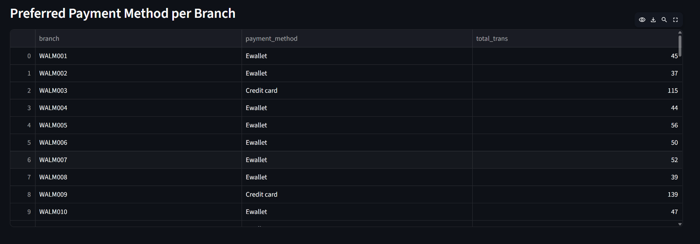
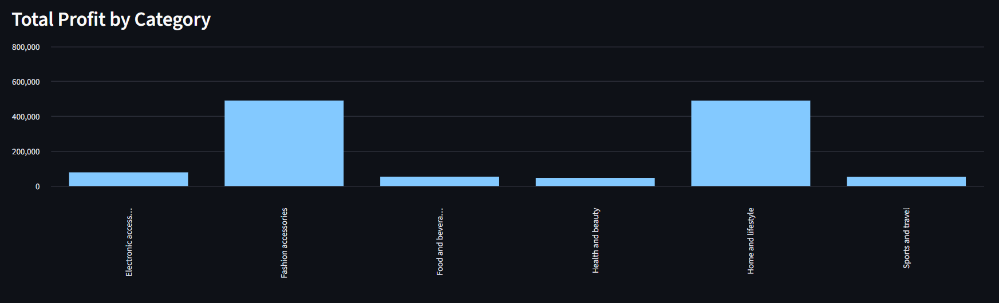
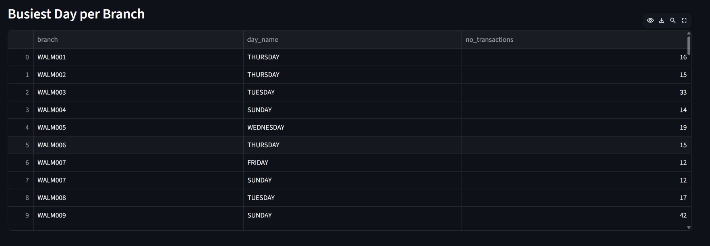
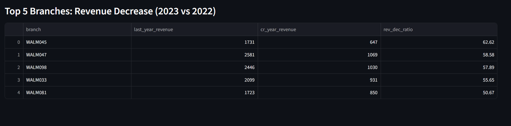

# Walmart Sales Data Analysis: End-to-End SQL + Python Project

An end-to-end data analysis project that extracts business insights from Walmart sales data — from raw CSV to a live, interactive dashboard.

**🔗 Live Dashboard:** [walmart-sales-analysis-praviksha.streamlit.app](https://walmart-sales-analysis-praviksha.streamlit.app/)
**📂 Repository:** [github.com/PravikshaShetty/walmart-data-analysis](https://github.com/PravikshaShetty/walmart-data-analysis)

---

## Project Overview

This project simulates a real-world data analyst workflow: pulling raw sales data, cleaning and transforming it with Python, loading it into a cloud-hosted PostgreSQL database, answering business questions with SQL, and presenting the results through an interactive Streamlit dashboard.

**Pipeline:**
```
Kaggle (raw data) → Python/Pandas (clean & transform) → PostgreSQL (Neon, cloud-hosted) → SQL (business analysis) → Streamlit (interactive dashboard)
```

---

## Tech Stack

| Layer | Tools |
|---|---|
| Language | Python 3.8+ |
| Data Processing | Pandas, NumPy |
| Database | PostgreSQL (hosted on [Neon](https://neon.tech)) |
| DB Connectivity | SQLAlchemy, psycopg2-binary |
| Analysis | SQL (window functions, CTEs, aggregations) |
| Dashboard | Streamlit |
| Version Control | Git & GitHub |

---

## Live Dashboard

The dashboard is deployed on Streamlit Community Cloud and connects live to a Neon-hosted PostgreSQL database.

👉 **[View the live dashboard here](https://walmart-sales-analysis-praviksha.streamlit.app/)**

*(Note: the app may take 30–60 seconds to wake up if it's been idle.)*



---

## Business Questions Answered

The SQL analysis (see [`PSQL Queries.sql`](./PSQL%20Queries.sql)) answers questions including:

1. Payment method distribution and quantity sold
2. Highest-rated product category per branch
3. Busiest day of the week per branch
4. Average, min, and max rating by city and category
5. Total revenue and profit by category
6. Most preferred payment method per branch
7. Sales distribution across morning / afternoon / evening shifts
8. Top 5 branches with the highest year-over-year revenue decline (2023 vs 2022)

---

## Key Insights

**Payment Behavior**
- **Credit card** is the most used payment method overall — 4,256 transactions totaling 9,567 units sold — ahead of E-wallet (3,881 transactions, 8,932 units) and Cash (1,832 transactions, 4,984 units).
- Interestingly, at the individual branch level, **E-wallet is the most preferred payment method for most branches**, even though credit card leads in the overall totals — a handful of high-volume branches (e.g. WALM003, WALM009) skew heavily toward credit card and pull up the overall numbers.



**Category Performance & Profitability**
- Top-rated categories vary widely by branch — for example, WALM009 rates *Sports and travel* at 9.6, WALM004 rates *Food and beverages* at 9.3, and WALM010 rates *Electronic accessories* at 9.0 — showing no single category dominates customer satisfaction across all locations.
- **Fashion accessories** and **Home and lifestyle** are by far the most profitable categories, each generating roughly 10x the profit of other categories like Electronics, Health & Beauty, and Sports & Travel.



**Timing Patterns**
- Busiest days differ significantly by branch — some peak on Sunday (e.g. WALM009 with 42 transactions), others on Tuesday (WALM003 with 33) — suggesting local, branch-specific shopping patterns rather than a single company-wide trend.
- Across all branches, the **afternoon shift sees the highest sales volume**, followed by evening, with mornings being the quietest period.



**Revenue Trends**
- The top 5 branches with the steepest year-over-year revenue decline (2023 vs 2022) all saw drops exceeding **50%**, led by **WALM045 at a 62.6% decline** (from 1,731 to 647 in revenue), followed by WALM047 (58.6%), WALM098 (57.9%), WALM033 (55.7%), and WALM081 (50.7%) — a clear signal for further business investigation into these specific locations.



---

## Project Structure

```
├── app.py                          # Streamlit dashboard
├── project.ipynb                   # Data cleaning & transformation notebook
├── PSQL Queries.sql                # SQL business analysis queries
├── requirements.txt                # Python dependencies
├── Walmart.csv                     # Raw dataset
├── walmart_clean_data.csv          # Cleaned dataset
├── screenshots/                    # Dashboard screenshots used in this README
└── .streamlit/
    └── secrets.toml                # DB credentials (not tracked in git)
```

---

## Getting Started (Run Locally)

**1. Clone the repository**
```bash
git clone https://github.com/PravikshaShetty/walmart-data-analysis.git
cd walmart-data-analysis
```

**2. Install dependencies**
```bash
pip install -r requirements.txt
```

**3. Set up your database connection**

Create a `.streamlit/secrets.toml` file with your own PostgreSQL connection string:
```toml
DB_CONNECTION = "postgresql://<user>:<password>@<host>/<database>?sslmode=require"
```

**4. Run the dashboard**
```bash
streamlit run app.py
```

---

## Data Source

- **Dataset:** Walmart Sales Dataset (Kaggle)
- **Inspiration:** Walmart's real-world business case studies on sales and supply chain optimization

---

## Future Enhancements

- Add interactive filters/date-range selectors to the dashboard for deeper exploration
- Investigate root causes behind the sharpest revenue-decline branches
- Automate the data pipeline for real-time ingestion and analysis

---

## License

This project is licensed under the MIT License.
